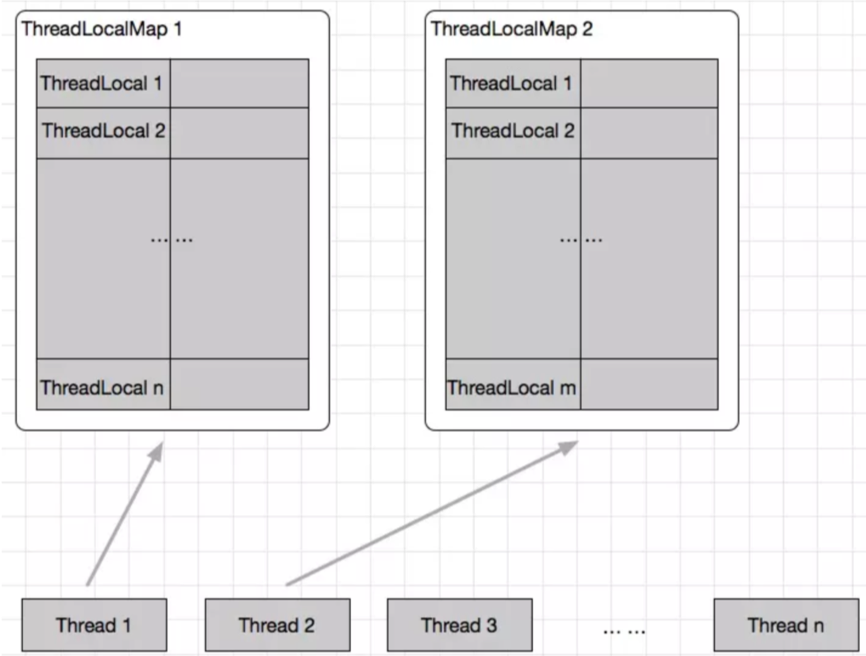

ThreadLocal:
1. ThreadLocal, Thread与ThreadLocalMap三者的关系:
    
    - 可见,ThreadLocalMap本质是Thread的一个属性
    - ThreadLocalMap中包含多个key为ThreadLocal，value为Object的Entry
    
2. ThreadLocal一些比较重要的方法:
    - `initialValue`: 重写initialValue可使用懒加载，在get()时获取属性值
    - `set`: 
    - `get`:
    - `remove`:
    
3. ThreadLocalMap:
    - 可以看作是一个HashMap，但是采用的解决哈希冲突的方法是`线性探测`
    - 该Map默认Key类型为ThreadLocal
 
4. ThreadLocal在使用时容易发生内存泄露的地方:
    - ThreadLocalMap中的Key为弱引用，但value是强引用
    - 在线程池场景中，有一些core线程可能是很长时间不终止的；
    这时候随着处理任务量的增大，ThreadLocalMap可能会逐渐累积；
    一个好的最佳实践是在不需要ThreadLocal变量时，将其remove