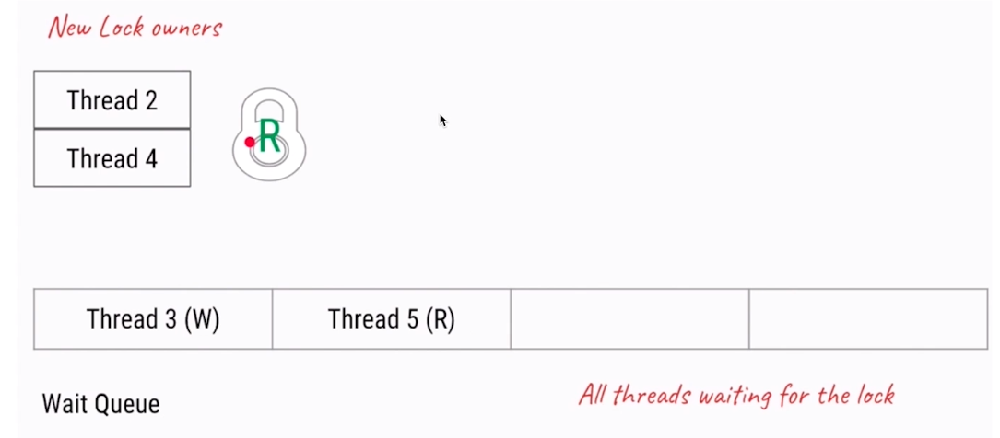

Lock

1. synchronized相比Lock的不足:
    - 效率低: 锁只有发生异常/代码块运行结束才能释放；
    试图获得锁时不能设定超时，头铁；
    - 不够灵活: 单一条件加锁，不能分辨读写两种不同的情况
    - 无法预先知道是否能够成功获取到锁
    
2. Lock的三个方法:
    - `lock`: 尝试获取锁，一旦尝试，无法中断，和synchronized比较类似
    - `tryLock`: 返回boolean值，代表锁获取是否成功；
    当不传入参数时，代表马上返回获取锁的状态；
    当传入参数时，会等待x秒之后再判断是否获取到锁
    - `lockInterruptibly`: `tryLock`的永久等待版本，类似于lock，但是可以中断

3. 乐观锁与悲观锁:
    - 非互斥同步锁(乐观锁)的诞生，互斥同步锁(悲观锁)的劣势:
        - 阻塞和唤醒带来的**性能**劣势(CPU态切换，上下文切换等)
        - 可能陷入永久阻塞
        - 优先级反转(低优先级线程获得锁并一直阻塞)
    - 乐观锁: 允许并发修改，若检测到资源版本没有发生变化，就修改；否则采取其他措施(一般用`CAS算法`)
    - 悲观锁: 同一时间只能有一个线程在访问某共享资源
    - 一些乐观锁的例子:
        - 原子类，并发容器等
        - Git
        - 数据库MVCC(多版本并发控制)
    - 一些悲观锁的例子:
        - synchronized, lock
        - 数据库select for update
    - 乐观锁与悲观锁的使用场景:
        - 悲观锁:
            - 并发写入多
            - 临界区锁竞争很激烈
            - 代码逻辑复杂
        - 乐观锁:
            - 并发写入少，读取多
            
4. 可重入锁:
    - 可重入锁的概念: 可重入锁可以被持有锁的线程同时获取多份, 
    使用`getHoldCount`方法可以查看获取次数

5. 公平锁与非公平锁:
    - 抢锁策略不同
    - 公平锁会按照先入先出的顺序，严格从队列队首取线程顺序获取锁
    - 非公平锁利用线程从`阻塞 -> Running`的空档期，安排其他活动线程获取锁
    - 公平锁吞吐量高，但可能会引起`饥饿现象`
    
6. 读写锁:
    - 读写锁策略:
        - 读锁与读锁之间不阻塞，多个线程可以同时获取读锁读
        - 写锁与写锁和读锁都会阻塞，同一时间只能由一个线程写
    - 读写锁的公平策略:
        - 跟公平锁策略是一样的，不允许插队
    - 读写锁的非公平策略:
        
        - 线程请求读时，如果队列头是写请求，则该请求会被放到队列尾；
        如果队列头是读请求(很少见但也存在)，则该请求允许插队；
        - 线程请求写时，可以插队，当检测到没有线程在读/写时，可以直接获取写锁；
        否则会放置到队列尾
    - 读写锁的升降级:
        - ReentrantReadWriteLock允许降级但不允许升级
        - 降级可以在不释放写锁的情况下直接获得读锁，提高系统性能
        - 升级可以在不释放读锁的情况下直接获得写锁，但是容易引起死锁(两个线程同时请求升级)
    