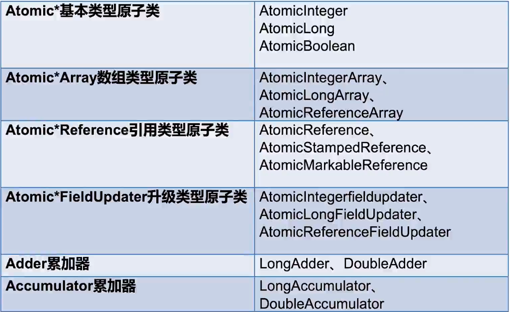

Java原子类:
1. 原子类的优点与缺点:
    - 锁粒度更细
    - 效率更高，但在高度竞争情况下效率会降低
   
2. 六种原子类:
    
    - Atomic*: 基本类型原子类，有Integer，Long，Boolean等
    - Atomic*Array: 基础类型/引用类型原子数组，数组中各个索引位置操作时都是线程安全的
    - AtomicReference: 引用类型原子类
    - Atomic*FieldUpdater: 将普通变量升级为原子类(针对一个自定义类的某个字段)
    - LongAdder/DoubleAdder: 原子累加器，采用分段概念(每个线程一段)
    - Accumulator: 多线程进行无序累加的利器
   
3. AtomicLong与LongAdder的原理剖析:
    - AtomicLong在累加时，多个线程需要时刻flush和reflush数据，
    即每一次加法都需要做同步，高并发时效率较低
    - LongAdder内部使用一个`sum`变量和`Cell[]`数组辅助计算，
    当并发度低时，多个线程同时对sum进行操作，
    当并发度高时，每个线程单独维护一个自己的计数器，即Cell[k] (k是哈希之后该线程对应的索引)