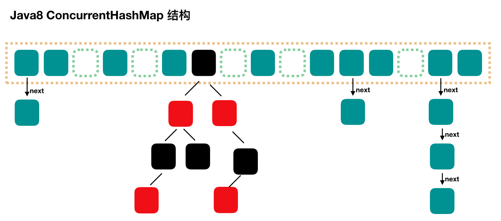

并发容器相关:
1. Java并发容器的历史:
    - `Vector` 与 `HashTable`: 所有并发相关操作都采用synchronized来保证安全，效率低下
    - `Collections.synchronized*`: 与`Vector`和`HashTable`类似
    - `CopyOnWriteArrayList` 与 `ConcurrentHashMap`: 效率更高
    
2. Java1.7的ConcurrentHashMap:
    
    - 采用分段锁，默认是16段，每段都使用一个可重入锁保证线程安全
    - 每个Segment可看作一个更小的HashMap，通过锁来保证线程安全
    - 降低了锁的粒度，提高了并发效率
    - 在1.7版本中，底层的HashMap默认都是使用拉链法来解决哈希冲突
    
3. Java1.8的ConcurrentHashMap:
    
    - 比起1.7，更进一步减小了锁的粒度，提高效率
    - 将段的概念替换成Node，对每个Node通过`CAS` + `synchronized`
    来保证线程安全
    - 采用拉链法与红黑树来解决哈希冲突，阈值为8时会从链表转为红黑树