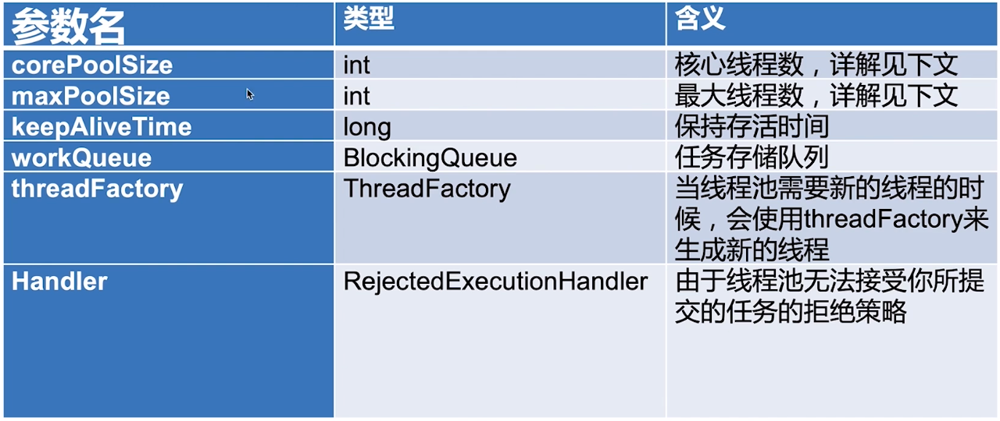
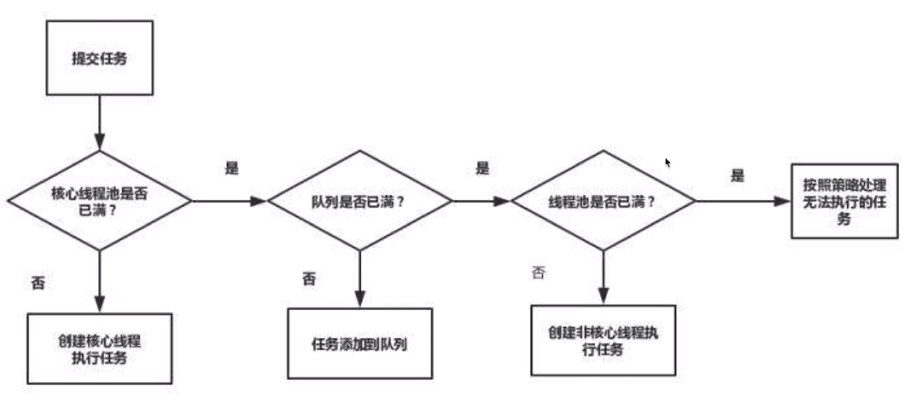
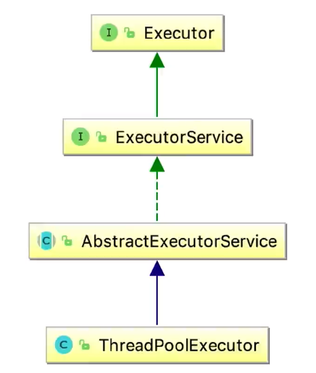

线程池:
1. 为什么要使用线程池，传统做法的弊
    - 反复创建线程开销很大(Java线程直接对应OS线程)
    - 过多的线程会占用太多内存
    - 使用线程池之后，可以解决上面两个问题
    
2. 使用线程池的好处:
    - 加快响应速度(无需反复创建线程，开销小，速度快)
    - 合理利用CPU和内存(创建线程池时的各个参数可以自己指定，可以合理规划参数以最大效率利用硬件)
    - 统一管理线程(以线程池为媒介批量对线程进行操作)
    
3. 线程池的一些参数:
    
    - corePoolSize与maxPoolSize
        - corePoolSize: 核心线程数，workQueue未满时的最大线程数
        - maxPoolSize: 最大线程数，workQueue满了之后的最大线程数
        
    - keepAliveTime: 非核心线程的存在时间
    - workQueue: 承载任务的缓冲队列
        - SynchronousQueue: 类似于Go中默认channel，无法承载元素的队列
        - LinkedBlockingQueue: 容量无限的阻塞队列
        - ArrayBlockingQueue: 可设置固定容量的阻塞队列
    - threadFactory: 创建工厂的策略，可使用Java默认的defaultThreadFactory
    
4. Java四种自带线程池
    - FixedThreadPool: 传入nthreads参数，表示coreSize和maxSize都为nthreads，并采用LinkedBlockingQueue
    作为工作队列
    - SingleThreadPool: 默认1为coreSize和maxSize，并使用LinkedBlockingQueue作为工作队列
    - CachedThreadPool: coreSize为0，maxSize为infinity，并使用SynchronousQueue
    作为工作队列，默认超时时间为60s
    - ScheduledThreadPool: 可以周期性地执行任务
    
5. 线程池设置线程数量的策略:
    - CPU密集型任务: CPU核心数的1-2倍左右
    - IO密集型: 数倍于CPU核心数
        - 一个通用的计算公式: 
        `thread_num = cpu_cores * (1 + average_wait / average_work)`
    
6. 关于停止线程池的五个方法:
    - shutdown: 告诉线程池停止，之后线程池将不再接受新的任务，而正在
    执行的任务以及工作队列中的任务仍会执行完才终止
    - isShutDown: 判断线程池是否被shutdown
    - isTerminated: 判断线程池是否终止(指shutdown后任务全部执行完/被强制中断)
    - awaitTermination: 判断在x秒之后，程序是否处于终止状态;执行完此语句之后，会一直阻塞直到超时
    - shutdownNow: 向所有正在执行的线程发出中断信号，立马终止并返回工作队列中的剩余任务

7. Java线程池类之间的关系:
    
    - 常用的Executors是一个工具类

