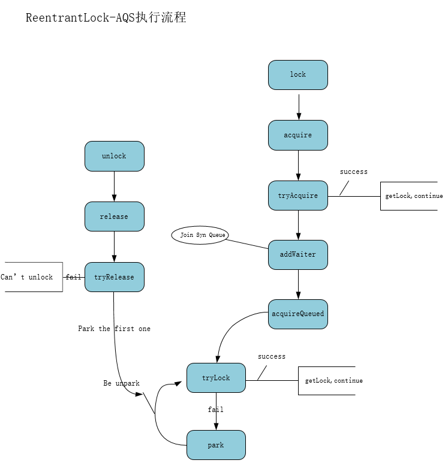
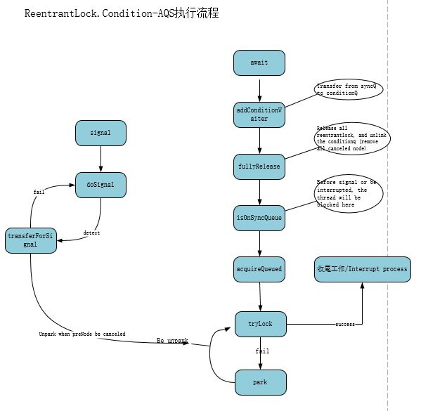
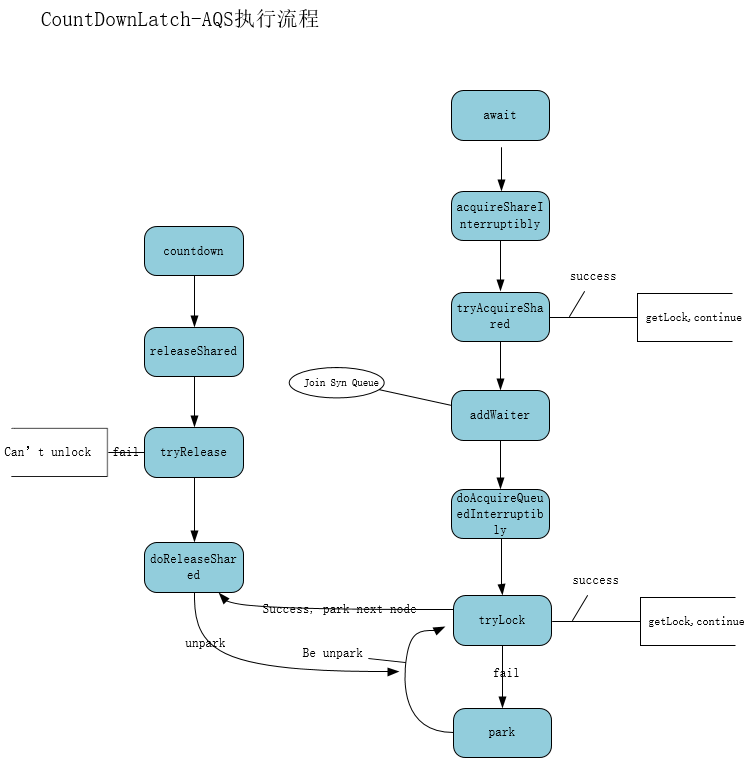
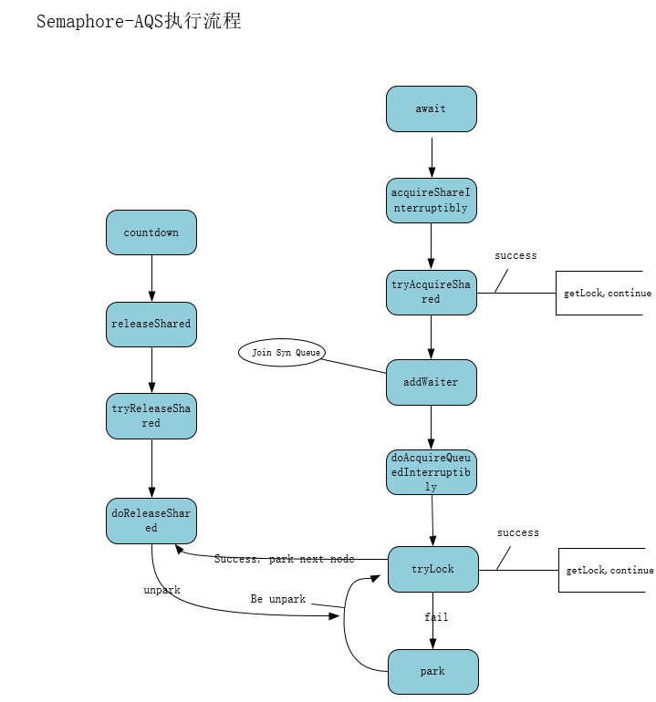

AQS对几种常用工具的源码解读
1. `ReentrantLock`:
    
    - 对于非公平锁，在acquire前还会尝试抢一下锁(使用CAS)
    - addWaiter只使用CAS将新节点添加进阻塞队列，所有节点的waitStatus不会在这里被改变
    - 在acquireQueued中抢锁失败之后，会进入`shouldParkAfterFailedAcquire`方法中，
    这里会改变当前节点的前一个节点的waitStatus，并判断是否要挂起当前线程
    - lock方法不响应中断，但在acquireQueued整个执行过程中，会维护
    中断状态，并在方法返回之前重新设置中断状态
    - 对于`tryRelease`失败的情况，主要有以下几种:
        - 调用unlock的线程不持有锁，抛出`IllegalMonitorxxx`异常
        - `ReentrantLock`多次重入，当前释放没有释放干净
    
2. `Condition`:

    
    - `addConditionWaiter`会将当前线程转移到条件队列尾部
    - `fullyRelease`会释放当前线程所有锁(ReentrantLock可重入)，
    并进行一些简单的收尾工作(比如把条件队列中被取消的节点移除)
    - `isOnSyncQueue`判断当前线程是否在阻塞队列中，如果不在的话，就会一直阻塞在这里；
    其实这个过程就是释放锁之后，signal之前线程所处的状态(一般情况下)
    - 有几种办法可以让线程从`isOnSyncQueue`自旋中逃离:
        - 被signal，加入到阻塞队列之后，一直到被唤醒
        - 被signal，但在`transferForSignal`过程发现前一个结点waitStatus不对或设置失败，
        这时候直接唤醒
        - 被中断，无论在signal执行前后被中断都会导致从挂起状态苏醒
    - 从`isOnSyncQueue`苏醒之后，就跟被`lock`的线程后半部分执行情况差不多了，
    但是`Condition`在最后还会进行一些收尾操作再放行

3. `CountDownLatch`

    
    - 整体流程跟ReentrantLock基本一致，不过是独占Node和共享Node调用的方法不同
    - `doAcquireQueuedInterruptibly`成功获取锁之后，会尝试唤醒阻塞队列节点
    - `tryRelease`会取唤醒阻塞队列中的节点，那`doAcquireQueuedInterruptibly`为什么也去唤醒?
        - 个人理解: 增大系统吞吐量，因为CountDownLatch所有节点都要被唤醒
        - 只由`tryRelease`调用一次的话，可能导致`h == head`的情况跳出循环，后面节点无法再唤醒；
        详见下面的`doReleaseShared`源码解析
    - `doReleaseShared`会尝试唤醒所有阻塞队列的节点，源码中是一个for循环:
        ````
      private void doReleaseShared() {
          for (;;) {
              Node h = head;
              if (h != null && h != tail) {
                  int ws = h.waitStatus;
                  if (ws == Node.SIGNAL) {
                      if (!compareAndSetWaitStatus(h, Node.SIGNAL, 0))
                          continue;            // loop to recheck cases
                      unparkSuccessor(h);
                  }
                  else if (ws == 0 &&
                           !compareAndSetWaitStatus(h, 0, Node.PROPAGATE))
                      continue;                // loop on failed CAS
              }
              if (h == head)                   // loop if head changed
                  break;
          }
      }
        ````
        当`h == head`时，说明`unparkSuccessor`还没有成功唤醒下一个节点，或者唤醒之后还未执行`setHead`方法,
        这时候跳出循环，等待`setHeadAndPropagate`调完`setHead`之后再去调`doReleaseShared`就行了

4. `Semaphore`:

    
    - 与`CountDownLatch`基本是一样的步骤
    - 与`CountDownLatch`的不同之处:
        - 工具本身的功能不一样:
            - `CountDownLatch`一次`Release`之后，所有节点(无论阻塞队列中或是新来的线程)，都要直接放行
            - `Semaphore`还需要判断许可证数量，所以在具体执行时，`doReleaseShared`会被卡住；
            但是由于代码写的实在过强，`Semaphore`和`CountDownLatch`两种不同情况被统一了
            
5. 个人阅读源码感受:
    - 使用`Node`的过程，也就是维护双向链表，其中保证线程安全的方式很精妙:
        - 通过双向链表两个指针，`prev`和`next`来保证线程安全
        - `prev`指向的过程一般不是线程安全的，但之后通过`CAS`设置
        `next`的过程，能够保证整个过程是线程安全的
    - 使用`AQS`实现某个具体类的过程很套路化:
        - 正如上面`ReentrantLock`，`CountDownLatch`和`Semaphore`流程图一样，
        大部分流程是相同的，不过独占和共享调用的方法名有所区别
        - 对于那些可以相应中断的方法，不过是维护一个`interruptMode`状态，最后
        再调用`selfInterrupt`方法来判断是否抛出`InterruptedException`